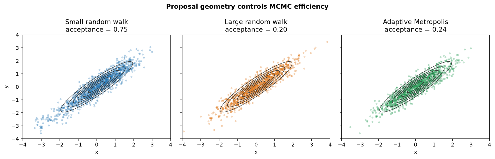

# Adaptive Metropolis and MCMC

[](https://github.com/Bahareh527/adaptive-metropolis-mcmc/actions/workflows/ci.yml)
[](https://www.python.org/)
[](LICENSE)

An educational and reproducible exploration of Metropolis-Hastings, proposal design, Markov-chain diagnostics, and Adaptive Metropolis. The project combines an executed teaching notebook with tested, reusable Python implementations.



## Research questions

- How does proposal scale affect acceptance and effective sample size?
- Why can a multiplicative proposal outperform an additive proposal for a positive, skewed target?
- Can online covariance adaptation improve exploration of a strongly correlated target?

## Experiments

The first experiment samples a heavy-tailed log-normal target using additive and multiplicative proposals. The multiplicative sampler includes the required Hastings correction. The second compares small and large isotropic random walks with Adaptive Metropolis on a correlated bivariate Gaussian.

The complete explanations, equations, experiments, plots, and conclusions are in [the executed notebook](notebooks/metropolis_hastings_and_adaptive_metropolis.ipynb).

## Installation

```bash
git clone https://github.com/Bahareh527/adaptive-metropolis-mcmc.git
cd adaptive-metropolis-mcmc
python -m venv .venv
# Windows: .venv\Scripts\activate
# macOS/Linux: source .venv/bin/activate
python -m pip install -e ".[notebook]"
```

Open the notebook with:

```bash
jupyter lab notebooks/metropolis_hastings_and_adaptive_metropolis.ipynb
```

## Python API

```python
import numpy as np
from mcmc_research import lognormal_logpdf, multiplicative_metropolis_1d

rng = np.random.default_rng(42)
result = multiplicative_metropolis_1d(
    target_logpdf=lambda x: float(lognormal_logpdf(x)),
    initial_state=1.0,
    n_steps=20_000,
    log_step_scale=1.0,
    rng=rng,
)
print(result.acceptance_rate)
```

## Reproducibility and validation

Every experiment uses a fixed random seed. The diagnostics use an initial-positive-pair truncation for integrated autocorrelation time instead of summing noisy positive lags indiscriminately. Automated tests cover deterministic behavior, input validation, the Hastings correction, target moments, covariance learning, and diagnostic sanity checks.

```bash
python -m pip install -e ".[dev]"
ruff check .
pytest
```


## References

- W. K. Hastings, “Monte Carlo sampling methods using Markov chains and their applications,” *Biometrika*, 57(1), 97–109, 1970. [doi:10.1093/biomet/57.1.97](https://doi.org/10.1093/biomet/57.1.97)
- H. Haario, E. Saksman, and J. Tamminen, “An Adaptive Metropolis Algorithm,” *Bernoulli*, 7(2), 223–242, 2001. [doi:10.2307/3318737](https://doi.org/10.2307/3318737)

## Scope

The implementations favor clarity and education. For production Bayesian inference, use a mature library with convergence diagnostics across multiple chains.

## License

Released under the [MIT License](LICENSE).

